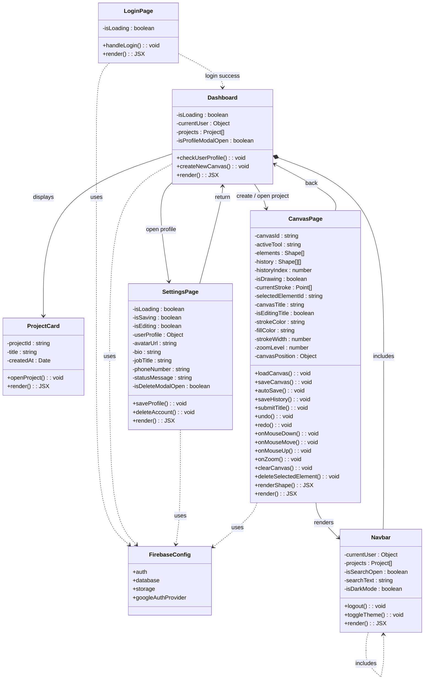

<p align="center">
  
  
  
  
  
</p>

<h1 align="center">🎨 PrisMap</h1>

<p align="center">
  <strong>Your Infinite Collaborative Canvas</strong>
</p>

<p align="center">
  A modern, feature-rich drawing application built with Next.js 16 and React 19.<br/>
  PrisMap offers an infinite canvas, real-time cloud persistence via Firebase,<br/>
  powerful drawing & design tools, and a stunning glassmorphism UI with dark/light themes.
</p>

---

## 📑 Table of Contents

- [Overview](#-overview)
- [Features](#-features)
- [Tech Stack](#-tech-stack)
- [Project Structure](#-project-structure)
- [Getting Started](#-getting-started)
- [Environment Variables](#-environment-variables)
- [Available Scripts](#-available-scripts)
- [Keyboard Shortcuts](#-keyboard-shortcuts)
- [Application Pages](#-application-pages)
- [Architecture & Design](#-architecture--design)
- [UML Diagrams](#-uml-diagrams)
- [Contributing](#-contributing)
- [Acknowledgments](#-acknowledgments)

---

## 🔎 Overview

**PrisMap** is a web-based infinite canvas application designed for drawing, diagramming, and visual collaboration. It combines the power of **Konva.js** for 2D canvas rendering with **Firebase** for authentication, real-time data persistence, and cloud storage — all wrapped in a premium glassmorphism interface.

Users sign in with **Google**, land on a personal **dashboard** of canvas projects, and can create unlimited canvases — each with its own URL — that auto-save to the cloud.

---

## ✨ Features

### 🖌️ Drawing & Design Tools

| Tool | Description |
|------|-------------|
| **Select** | Click to select, move, and resize elements with interactive transform handles |
| **Pen** | Freehand drawing with customizable stroke color and width |
| **Eraser** | Smart eraser that splits strokes at intersection points for precise removal |
| **Text** | Place editable text anywhere; double-click to inline-edit with a styled textarea overlay |
| **Rectangle** | Draw rectangles with custom fill and stroke |
| **Circle** | Draw circles/ellipses with custom fill and stroke |
| **Triangle** | Draw triangles with custom fill and stroke |
| **Star** | Draw star shapes with custom fill and stroke |
| **Arrow** | Draw directional arrows |
| **Image Upload** | Upload images to Firebase Storage and place them on the canvas |

### 🎯 Canvas Capabilities

- **Infinite Canvas** — Pan freely in any direction with no boundaries
- **Scroll-to-Zoom** — Mouse wheel zooming centered on cursor position (range: 10%–500%)
- **Zoom Controls** — Dedicated zoom in / zoom out / reset-to-100% buttons
- **Undo / Redo** — Full action history with `Ctrl+Z` / `Ctrl+Y` (or `Ctrl+Shift+Z`)
- **Auto-Save** — Debounced auto-save (2-second delay) to Firestore after every change
- **Manual Save** — `Ctrl+S` for instant save
- **Editable Canvas Title** — Click the title in the toolbar to rename; persists to Firestore

### ✂️ Editing Operations

- **Copy / Paste** — `Ctrl+C` / `Ctrl+V` with positional offset for pasted elements
- **Duplicate** — `Ctrl+D` to instantly duplicate the selected element
- **Delete** — `Delete` or `Backspace` to remove selected elements
- **Z-Index Control** — `]` / `[` to move forward/backward; `Shift+]` / `Shift+[` for front/back
- **Alignment** — Align multiple selected elements (left, center, right, top, middle, bottom)
- **Distribution** — Evenly distribute 3+ selected elements horizontally or vertically
- **Transform Handles** — Resize and manipulate shapes via Konva's built-in Transformer

### 🔤 Typography

- **10 Font Families** — Arial, Helvetica, Times New Roman, Georgia, Courier New, Verdana, Impact, Comic Sans MS, Trebuchet MS, Palatino Linotype
- **Font Size Control** — Adjustable font size for text elements
- **Bold & Italic** — Toggle bold and italic styles independently
- **Color Picker** — Set text color with a native color input

### 📐 Layers Panel

- **Visual Layer List** — See all canvas elements with type icons and truncated labels
- **Visibility Toggle** — Show/hide individual elements (eye icon)
- **Lock Toggle** — Lock elements to prevent accidental edits
- **Reorder** — Move layers up/down in the z-stack
- **Opacity Control** — Adjust per-element opacity

### 📤 Export

- **PNG Export** — Export canvas at 2× pixel ratio for high-resolution output
- **JPG Export** — Export as JPEG with 90% quality at 2× pixel ratio
- **Custom Filename** — Exported files are named using the canvas title

### 🎨 User Experience

- **Glassmorphism Design** — Translucent panels with backdrop blur, subtle shadows, and gradient accents
- **Dark / Light Theme** — Toggle with a single click; preference persisted in `localStorage`
- **Glossy Text in Dark Mode** — IntelliJ-inspired gradient text effect for headings
- **Background Patterns** — Toggle between grid and dot backgrounds with `G` key
- **Floating Navbar** — Pill-shaped, glass-effect navigation bar with search, theme toggle, shortcuts, and settings
- **Search Modal** — `Ctrl+K` to search projects by title from anywhere in the app
- **Responsive Layout** — Adapts to different screen sizes

### 🔐 Authentication & User Management

- **Google Sign-In** — One-click authentication via Firebase with popup flow
- **Protected Routes** — Dashboard, canvas, and settings pages redirect to login if unauthenticated
- **User Profile** — Settings page to manage avatar, bio, job title, and phone number (with country code)
- **Profile Completion Prompt** — Modal on dashboard prompts new users to complete their profile
- **Account Deletion** — Permanent account removal with "type DELETE to confirm" safeguard; batch-deletes all user data

---

## 🛠️ Tech Stack

| Technology | Version | Purpose |
|---|---|---|
| [Next.js](https://nextjs.org/) | 16.1.1 | React framework with App Router, server components, and file-based routing |
| [React](https://react.dev/) | 19.2.3 | UI component library with hooks and React Compiler support |
| [Tailwind CSS](https://tailwindcss.com/) | 4.x | Utility-first CSS framework for rapid, responsive styling |
| [Konva.js](https://konvajs.org/) | 10.2.0 | High-performance 2D canvas library for shapes, lines, images, and transforms |
| [React Konva](https://konvajs.org/docs/react/) | 19.2.1 | Declarative React bindings for Konva.js |
| [Firebase Auth](https://firebase.google.com/docs/auth) | 12.7.0 | Google Sign-In authentication |
| [Cloud Firestore](https://firebase.google.com/docs/firestore) | 12.7.0 | Real-time NoSQL database for canvas data and user profiles |
| [Firebase Storage](https://firebase.google.com/docs/storage) | 12.7.0 | Cloud storage for uploaded canvas images |
| [Lucide React](https://lucide.dev/) | 0.562.0 | Beautiful, consistent open-source icon library |
| [uuid](https://www.npmjs.com/package/uuid) | 13.0.0 | Unique ID generation for canvas documents |
| [react-rnd](https://github.com/bokuweb/react-rnd) | 10.5.2 | Resizable and draggable component support |
| [React Compiler](https://react.dev/learn/react-compiler) | 1.0.0 | Babel plugin for automatic memoization (dev dependency) |

---

## 📁 Project Structure

```
PrisMap/
├── public/                     # Static assets (SVG icons, favicon)
├── src/
│   ├── app/                    # Next.js App Router
│   │   ├── canvas/
│   │   │   └── [id]/
│   │   │       └── page.jsx    # Infinite canvas workspace (main editor)
│   │   ├── dashboard/
│   │   │   └── page.jsx        # User dashboard — project grid + create new
│   │   ├── settings_page/
│   │   │   └── page.jsx        # Profile management + account deletion
│   │   ├── shortcuts/
│   │   │   └── page.jsx        # Keyboard shortcuts reference page
│   │   ├── page.jsx            # Login page (Google Sign-In)
│   │   ├── layout.js           # Root layout with metadata
│   │   ├── globals.css         # Theme variables, glassmorphism, dark mode
│   │   └── favicon.ico
│   ├── components/
│   │   ├── Navbar.jsx          # Floating glass navbar with search modal
│   │   └── LayersPanel.jsx     # Layer management panel for canvas
│   ├── hooks/
│   │   └── useKeyboardShortcuts.js  # Custom keyboard shortcuts hook
│   └── lib/
│       └── firebase.js         # Firebase init (Auth, Firestore, Storage)
├── .env.local                  # Environment variables (not committed)
├── tailwind.config.js          # Tailwind CSS configuration
├── postcss.config.mjs          # PostCSS configuration
├── next.config.mjs             # Next.js configuration
├── eslint.config.mjs           # ESLint configuration
├── jsconfig.json               # Path alias (@/) configuration
└── package.json                # Dependencies & scripts
```

---

## 🚀 Getting Started

### Prerequisites

- **Node.js** v18 or higher
- **npm**, **yarn**, or **pnpm**
- A **Firebase project** with the following services enabled:
  - Authentication (Google Sign-In provider)
  - Cloud Firestore
  - Firebase Storage

### Installation

1. **Clone the repository**

   ```bash
   git clone https://github.com/Gowreesh1905/PrisMap.git
   cd PrisMap
   ```

2. **Install dependencies**

   ```bash
   npm install
   ```

3. **Set up Firebase**

   - Go to the [Firebase Console](https://console.firebase.google.com/) and create a new project (or use an existing one).
   - Enable **Authentication** → Sign-in method → **Google**.
   - Create a **Cloud Firestore** database (start in test mode or set up security rules).
   - Enable **Firebase Storage**.
   - Go to Project Settings → General → scroll to "Your apps" → add a **Web app** and copy the config values.

4. **Configure environment variables**

   Create a `.env.local` file in the project root:

   ```env
   NEXT_PUBLIC_FIREBASE_API_KEY=your_api_key
   NEXT_PUBLIC_FIREBASE_AUTH_DOMAIN=your_project.firebaseapp.com
   NEXT_PUBLIC_FIREBASE_PROJECT_ID=your_project_id
   NEXT_PUBLIC_FIREBASE_STORAGE_BUCKET=your_project.appspot.com
   NEXT_PUBLIC_FIREBASE_MESSAGING_SENDER_ID=your_sender_id
   NEXT_PUBLIC_FIREBASE_APP_ID=your_app_id
   ```

5. **Start the development server**

   ```bash
   npm run dev
   ```

6. **Open your browser**

   Navigate to [http://localhost:3000](http://localhost:3000) — you'll be greeted with the login page.

---

## 🔑 Environment Variables

All environment variables are prefixed with `NEXT_PUBLIC_` so they are available in client-side code.

| Variable | Description |
|---|---|
| `NEXT_PUBLIC_FIREBASE_API_KEY` | Firebase Web API key |
| `NEXT_PUBLIC_FIREBASE_AUTH_DOMAIN` | Firebase Auth domain |
| `NEXT_PUBLIC_FIREBASE_PROJECT_ID` | Firebase project ID |
| `NEXT_PUBLIC_FIREBASE_STORAGE_BUCKET` | Firebase Storage bucket URL |
| `NEXT_PUBLIC_FIREBASE_MESSAGING_SENDER_ID` | Firebase Cloud Messaging sender ID |
| `NEXT_PUBLIC_FIREBASE_APP_ID` | Firebase app ID |

> ⚠️ **Never commit `.env.local` to version control.** It is already listed in `.gitignore`.

---

## 📜 Available Scripts

| Command | Description |
|---|---|
| `npm run dev` | Start the Next.js development server with hot reload |
| `npm run build` | Create an optimized production build |
| `npm run start` | Serve the production build locally |
| `npm run lint` | Run ESLint to check for code quality issues |

---

## ⌨️ Keyboard Shortcuts

### Global Shortcuts

| Shortcut | Action |
|---|---|
| `Ctrl + K` | Open project search modal |
| `Ctrl + ,` | Navigate to settings page |
| `Escape` | Close dialogs / modals |

### Canvas Shortcuts

| Shortcut | Action |
|---|---|
| `Ctrl + Z` | Undo |
| `Ctrl + Y` / `Ctrl + Shift + Z` | Redo |
| `Ctrl + S` | Save canvas |
| `Ctrl + C` | Copy selected element |
| `Ctrl + V` | Paste copied element |
| `Ctrl + D` | Duplicate selected element |
| `Delete` / `Backspace` | Delete selected element |
| `Escape` | Deselect / cancel current action |
| `]` | Bring element forward one layer |
| `Shift + ]` | Bring element to front |
| `[` | Send element backward one layer |
| `Shift + [` | Send element to back |
| `G` | Toggle grid / dots background pattern |

### Tool Selection

| Key | Tool |
|---|---|
| `1` | Select |
| `2` | Pen |
| `3` | Eraser |
| `4` | Text |
| `5` | Rectangle |
| `6` | Circle |
| `7` | Triangle |
| `8` | Star |
| `9` | Arrow |

---

## � Application Pages

### 🔐 Login Page (`/`)
The entry point of the app. Features a glassmorphism card centered over animated gradient blobs. Users sign in with one click via Google OAuth.

### 📊 Dashboard (`/dashboard`)
A protected page displaying all the user's saved canvas projects in a responsive grid. Includes:
- "New Project" card to create a canvas (generates a UUID-based URL)
- Real-time project list via Firestore `onSnapshot`
- Profile completion prompt modal for new users
- Floating navbar with search, theme toggle, shortcuts, and settings

### 🎨 Canvas Editor (`/canvas/[id]`)
The core of PrisMap — a full-featured infinite canvas workspace. Key areas:
- **Left Toolbar** — Tool selection, color pickers, stroke width, image upload
- **Top Bar** — Canvas title (editable), undo/redo, save status, back button
- **Center** — Konva.js infinite canvas with grid/dot background
- **Right Panel** — Tabbed panel with Design (colors, fonts, alignment, z-index), Layers, and Export sections

### ⚙️ Settings Page (`/settings_page`)
Profile management with view/edit toggle. Includes:
- Google-sourced name and email (read-only)
- Editable bio, job title, phone number (with country code selector for 10 countries)
- Profile photo display (managed via Google)
- Danger zone with account + data deletion (requires typing "DELETE" to confirm)

### ⌨️ Shortcuts Page (`/shortcuts`)
A reference page listing all keyboard shortcuts, organized by category (Global, Canvas, Tools) with styled key badges and a glassmorphism card layout.

---

## 🏗 Architecture & Design

### Design System

PrisMap uses a **CSS custom properties** based theming system defined in `globals.css`:

| Token | Light Value | Dark Value |
|---|---|---|
| `--color-bg-base` | `#f9fafb` | `#0f0f11` |
| `--color-text-main` | `#1f2937` | `#f1f5f9` |
| `--color-card` | `#ffffff` | `#1a1a1f` |
| `--color-nav` | `rgba(255,255,255,0.85)` | `rgba(20,20,24,0.9)` |
| `--color-border-ui` | `rgba(0,0,0,0.1)` | `rgba(255,255,255,0.1)` |

### Data Model (Firestore)

**`canvases` collection:**
| Field | Type | Description |
|---|---|---|
| `id` | `string` | UUID of the canvas |
| `title` | `string` | User-defined canvas title |
| `elements` | `array` | Array of drawing element objects |
| `ownerId` | `string` | Firebase UID of the owner |
| `createdAt` | `timestamp` | Server timestamp |
| `updatedAt` | `timestamp` | Server timestamp |

**`users` collection:**
| Field | Type | Description |
|---|---|---|
| `uid` | `string` | Firebase UID |
| `email` | `string` | User email |
| `displayName` | `string` | Google display name |
| `photoURL` | `string` | Google profile photo URL |
| `customAvatar` | `string` | Custom avatar URL |
| `bio` | `string` | User biography |
| `jobTitle` | `string` | User job title |
| `phoneNumber` | `string` | Phone number |
| `countryCode` | `string` | Phone country code |
| `countryName` | `string` | Phone country name |
| `updatedAt` | `timestamp` | Last profile update |

---

## 🧩 UML Diagrams

### Class Diagram

Structure of the application's main components, their attributes, methods, and relationships.



---

## 🤝 Contributing

Contributions are welcome! Follow these steps:

1. **Fork** the repository
2. Create a feature branch:
   ```bash
   git checkout -b feature/amazing-feature
   ```
3. Commit your changes:
   ```bash
   git commit -m "Add amazing feature"
   ```
4. Push to your branch:
   ```bash
   git push origin feature/amazing-feature
   ```
5. Open a **Pull Request**

---

## � Acknowledgments

- Canvas engine powered by [Konva.js](https://konvajs.org/)
- Framework by [Next.js](https://nextjs.org/)
- Styling with [Tailwind CSS](https://tailwindcss.com/)
- Icons by [Lucide](https://lucide.dev/)
- Authentication & backend by [Firebase](https://firebase.google.com/)

---

<p align="center">
  <sub>Built with ❤️ by the PrisMap Team</sub>
</p>
